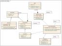
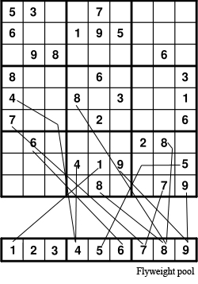
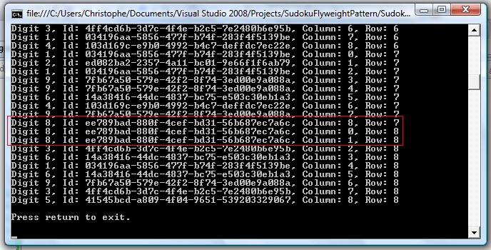

# Flyweight Pattern

## Introduction

Last weekend I found an [article](http://avnrao.blogspot.com/2005/10/sudoku-game-design.html) which discusses how to design a Sudoku Game using several design patterns. The article itself did not contain a concrete implementation of the design. I thought it would be fun to create a Sudoku game myself based on this guy's analysis. This would be a fun way to use several design patterns.

In total four design patterns are used to create the Sudoku game, namely:

1. Flyweight (Structural Pattern)
2. Composite (Structural Pattern)
3. Strategy (Behavioural Pattern)
4. Builder (Creational Pattern)

Rather than create one large article I will split this up into four parts. Each part focussing on one of the design patterns. In this first part a concrete implementation of the Flyweight pattern will be presented.

Let's get started...

## Sudoku Game

For those very few who have never played Sudoku, a quick summary of the objective of the game. Sudoku is a number placement puzzle. You are presented with a grid containing 81 cells, distributed in a 9×9 matrix. Apart from 9 rows and 9 columns there are also nine 3×3 boxes (also called blocks or regions). Each row, column and block has to contain the digits 1 to 9 only one time each.


So there are three simple rules to obey:

1. You cannot put the same digit in two or more cells of the same row.
2. You cannot put the same digit in two or more cells of the same column.
3. You cannot put the same digit in two or more cells of the same block.

You are presented with a partially filled 9×9 grid to start with. The difficulty of a puzzle is based on the positioning and relevance of the given digits rather than their quantity.

## The Design



If you look at the image above you will see the original design of the game by _Narasimha Rao._ The design shows a seperate Digit class who's only purpose is to represent the value of a cell in a Sudoku grid. For a Sudoku grid you would need at least 81 instances of this class type.

Actually you need twice that amount, you need two Digit instances per cell. One instance that stores the correct value for the cell which is provided by an algorithm that composes valid Sudoku grid solutions and another instance that stores the value entered by the player. These two instances can then be compared to see if they are equal (digitAnswer.Equals(digitGuess);).

So that totals up to 162 instances of the Digit class for one Sudoku grid. A tad much for a class which basically contains an integer value in its internal state. This might cripple the performance of the game.

Note: In the example that follows each cell only references one digit object instead of two.

## Flyweight Pattern

The flyweight pattern allows you to reduce the number of instances by making them sharable. To quote the [Gang of Four](http://en.wikipedia.org/wiki/Design_Patterns):

"_Use sharing to support large numbers of fine-grained objects efficiently._"

With the flyweight pattern you can reduce the number of Digit instances needed to 9. One Digit instance for each number from 1 to 9. Each cell is going to contain a reference to a Digit object. Various cells will contain references to the same instance, thus effectivly sharing them among the Sudoku grid.

Since a flyweight object is shared it is independant in each context. It cannot make assumptions about the context in which it is used. Thus in this example a Digit instance will not be ablle to know in which cell, row or column it is being used.

There is a difference between the intrinsic and extrinsic state of the object. The intrinsic state is stored in the internal state of the flyweight; the digit it contains is independant of the flyweight's context. The extrinsic state depends on the flyweight's context and cannot be shared. Client objects are responsible for passing the extrinsic state to the flyweight when needed. The integer value stored by the Digit object is intrinsic state, while the other information such as cell, row -and column number are extrinsic.



As you can derive from the above image each cell refers to a flyweight object in the shared pool of flyweight objects. By maintaining a shared pool of 9 flyweight Digit objects you can drastically reduce the number of Digit objects required.

## Participants

The participants for the Flyweight pattern are the following:

- **Flyweight (IDigit)**: Declares an interface through which flyweights can receive and act on extrinsic state.
- **Concrete Flyweight (Digit):** Implements the IDigit interface and adds storage for intrinsic state. An instance of this class must be sharable. Its internal state must be intrinsic since a concrete flyweight object is not aware of its context.
- **Unshared Concrete Flyweight**: A class which implements the flyweight interface (IDigit) but isn't shared. Not used in this example, but know that you can implement the flyweight interface for other non-shareable objects too.
- **Flyweight Factory (DigitFactory)**: Creates and manages flyweight (Digit) objects.
- **Client (a Sudoku grid)**: Maintains references to flyweight objects and maintains the extrinsic state for the flyweights.

## Flyweight (IDigit)

The IDigit interface declares an interface through which flyweights can receive and act on extrinsic state. Instead of an interface you could also use an abstract class.

**Listing 1** - IDigit Interface

```csharp
using System;

namespace CGeers.Sudoku
{
    public interface IDigit
    {
        Guid Id { get; }
        int Value { get; set; }
        string Display(GridContext gridContext);
    }
}
```

The IDigit interface declares two properties which the concrete flyweight class has to implement. One integer property which contains the value for a Digit object and one guid which uniquely identifies the object. I've added the guid Id just to illustrate that the Sudoku grid will only use digits from the flyweight pool which contains a maximum of 9 digit objects. If the grid displays the digit 8 in multiple cells then each cell will reference the same Digit object. The Guid Id is there just to show that the cells indeed reference the same object.

The interface also defines a method called Display which requires one parameter of the GridContext type. GridContext acts as a repository of extrinsic state allowing you to pass the column and row number of the cell which references the Digit object.

**Listing 2** - GridContext Class

```csharp
using System;

namespace CGeers.Sudoku
{
    public class GridContext
    {
        public int Column { get; set; }

        public int Row { get; set; }
    }
}
```

## Concrete Flyweight (Digit)

The Digit class, displayed in the listing below, implements the IDigit interface and provides two fields to store the intrinsic state, namely the value of the digit and an Id (a Guid) to uniquely identify objects instantiated from this type. The Id is generated automatically each time you create an instance of the Digit type by use of its constructor.

The Display method is implemented and displays the Digit's intrinsic state, namely the value and Id. This is followed by the extrinsic state which is passed via the gridContext parameter, which contains the column and row number of the cell which references an instance of the Digit type.

**Listing 3** - Digit Class

```csharp
using System;

namespace CGeers.Sudoku
{
    public class Digit : IDigit
    {
        #region Constructor

        public Digit()
        {
            Id = Guid.NewGuid();
        }

        #endregion

        #region IDigit Members

        /// <summary>
        /// Intrisic state
        /// </summary>
        public Guid Id { get; private set; }

        /// <summary>
        /// Intrisic state
        /// </summary>
        public int Value { get; set; }

        /// <summary>
        /// Intrisic state + act upon extrinsic state
        /// </summary>
        /// <param name="gridContext"></param>
        /// <returns></returns>
        public string Display(GridContext gridContext)
        {
            return String.Format("Digit {0}, Id: {1}, " +
                "Column: {2}, Row: {3}", Value, Id, gridContext.Column,
                gridContext.Row) + "\n\r";
        }

        #endregion
    }
}
```

## Flyweight Factory (DigitFactory)

The DigitFactory class creates and manages flyweight (Digit) objects. It is responsible for maintaining the flyweight pool which consists out of Digit objects. A DigitFactory maintains a keyed collection of Digit objects. The objects in the pool can be accessed through an indexer. You should not create instances of the Digit class yourself, you should obtain them from a DigitFactory object to ensure that they are shared properly.

**Listing 4** - DigitFactory Class

```csharp
using System;
using System.Collections.Generic;

namespace CGeers.Sudoku
{
    public class DigitFactory
    {
        private Dictionary<int, Digit> arrDigits = new Dictionary<int, Digit>();

        public Digit this[int key]
        {
            get
            {
                if (arrDigits.ContainsKey(key))
                {
                    return arrDigits[key];
                }
                else
                {
                    arrDigits.Add(key, new Digit());
                    arrDigits[key].Value = key;
                    return arrDigits[key];
                }
            }
            set { arrDigits[key] = value; }
        }
    }
}
```

You can instantiate an instance of the Digit type as follows:

```csharp
static Digit CreateDigitEight()
{
    DigitFactory digitFactory = new DigitFactory();
    Digit digit = digitFactory[8];
    return digit;
}
```

The indexer looks up a digit in the keyed collection, and returns it if the corresponding digit exists. If it doesn't then it creates the digit, puts it in the collection, and returns it.

## Client

To show the flyweight pattern in action lets create two additional classes. The class Cell represents a cell in a Sudoku grid which contains a reference to a Digit object from the flyweight pool.

**Listing 6** - Cell Class

```csharp
using System;

namespace CGeers.Sudoku
{
    public class Cell
    {
        public Digit Digit { get ; private set; }

        public int Row { get; set; }

        public int Column { get; set; }

        public Cell(Digit digit)
        {
            Digit = digit;
        }
    }
}
```

The SudokuGrid class represents a Sudoku grid. It maintains a collection of Cell objects. This collection consists out of 81 Cell objects, each cell object references a digit object which is returned by an instance of the DigitFactory type.

**Listing 7** - SudokuGrid Class

```csharp
using System;
using System.Collections.Generic;
using System.Collections.ObjectModel;

namespace CGeers.Sudoku
{
    public class SudokuGrid
    {
        private Collection<Cell> cells = new Collection<Cell>();
        private GridContext gridContext = new GridContext();

        public ICollection<Cell> Cells
        {
            get { return cells; }
        }

        /// <summary>
        /// Constructor for the SudokuGrid class.
        /// Generate 81 cells for the grid filled with random digits
        /// ranging from 1 to 9.
        /// </summary>
        public SudokuGrid(DigitFactory digitFactory)
        {
            Random random = new Random();
            for (int i = 0; i < 9; i++)
            {
                for (int j = 0; j < 9; j++)
                {
                    int value = random.Next(1, 10);
                    Cell cell = new Cell(digitFactory[value]);
                    cell.Row = i;
                    cell.Column = j;
                    Cells.Add(cell);
                }
            }
        }

        //Display the value for each cell in the grid.
        //Pass the extrinsic state (column &row) to the flyweight object.
        public string Display()
        {
            string result = String.Empty;
            foreach (Cell cell in Cells)
            {
                Digit digit = cell.Digit;
                gridContext.Row = cell.Row;
                gridContext.Column = cell.Column;
                result += digit.Display(gridContext);
            }
            return result;
        }
    }
}
```

Create a new Console application and add the code displayed in listing 8 to the static Main method.

**Listing 8** - A Sudoku Console Application

```csharp
using System;
using CGeers.Sudoku;

namespace SudokuConsoleApplication
{
    class Program
    {
        static void Main()
        {
            DigitFactory digitFactory = new DigitFactory();
            SudokuGrid sudokuGrid = new SudokuGrid(digitFactory);

            Console.WriteLine(sudokuGrid.Display());

            Console.WriteLine("\n\rPress return to exit.\n\r");
            Console.ReadLine();
        }
    }
}
```

The output of your console application should resemble the following screenshot. Ofcourse you'll get other values for the Guid Id's. If not, then Microsoft has a serious problem. Notice that digit objects which have the same value also have the same Id. They are one and the same object from the flyweight pool, which consists out of maximum 9 Digit objects.

**Listing 9** - The Output



## Summary

Use the Flyweight pattern when your application has to deal with a great number of objects. Keep in mind that a flyweight object only maintains intrinsic state, most of the object's state will be made extrinsic. This pattern allows you to share objects saving you valuable storage space and boosting your application's performance.
